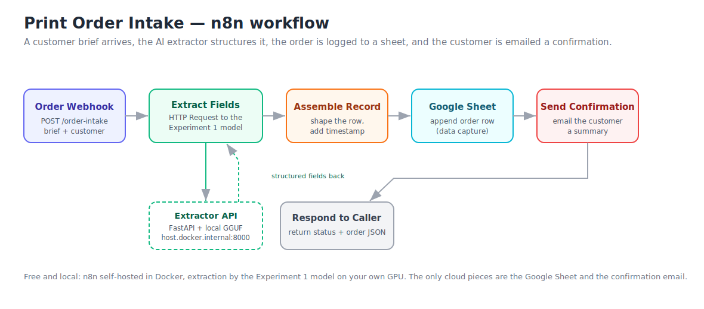

# Print Order Intake — n8n Workflow

An automated order-intake pipeline built in n8n. A customer brief arrives at a
webhook, the AI extractor from Experiment 1 turns it into structured fields, the
order is appended to a Google Sheet, and the customer receives a confirmation
email. It is the product concept in miniature: capture, understand, record,
respond, with no human keying anything in.



## How it fits together

```
Customer brief  ->  Order Webhook  ->  Extract Fields (HTTP)  ->  Assemble Record
                                              |                          |
                                       Extractor API                Google Sheet (append)
                                    (Experiment 1 model)                  |
                                                                   Send Confirmation (email)
                                                                          |
                                                                   Respond to caller
```

The extraction step reuses Experiment 1 directly. A small FastAPI server
(`api_server.py`) wraps the Experiment 1 extractor and exposes it at
`/extract`, and the workflow's HTTP node calls it. Everything except the Google
Sheet and the email runs locally and free.

## What is in this repo

```
n8n-order-intake/
  api_server.py                      FastAPI wrapper around the Experiment 1 extractor
  requirements.txt                   deps for the API server
  docker-compose.yml                 self-host n8n with one command
  workflow/print-order-intake.json   the importable n8n workflow
  sample_payload.json                an example incoming order
  test_webhook.ps1 / test_webhook.sh trigger the workflow
  docs/workflow-diagram.svg          architecture diagram
  data/intake_log.csv                local log of every captured order (created on first run)
```

## Prerequisites

- Docker Desktop installed and running.
- Experiment 1 (print-brief-extractor) working on this machine, in a virtual
  environment with llama-cpp-python and the GGUF model.
- A Google account (for the Sheet and the confirmation email).

## Step 1 — start the extractor API

In the virtual environment that runs Experiment 1, install the two extra
dependencies and start the server. Point EXP1_PATH at your Experiment 1 folder
if it differs from the default in `api_server.py`.

```powershell
pip install -r requirements.txt
$env:EXP1_PATH = "C:\Users\e16008577\Downloads\RP72026\github\print-brief-extractor"
uvicorn api_server:app --host 0.0.0.0 --port 8000
```

Check it is up by visiting http://localhost:8000/health, which should return
`{"status":"ok"}`. The `--host 0.0.0.0` part is important: it lets n8n inside
Docker reach the API at `http://host.docker.internal:8000`.

## Step 2 — start n8n

From this folder, in a second terminal:

```powershell
docker compose up -d
```

Open http://localhost:5678 and create the local owner account when prompted (this
is a one-time local login, nothing leaves your machine).

## Step 3 — import the workflow

In n8n, open the menu (top right), choose Import from File, and select
`workflow/print-order-intake.json`. The six nodes appear on the canvas. Two nodes
need credentials and one needs your sheet ID, covered next.

## Step 4 — create the Google Sheet

Create a new Google Sheet. In the first row, paste these column headers exactly
(the workflow maps fields to columns by name):

```
received_at	customer_name	customer_email	job_type	product	quantity	size	paper_stock	gsm	finish	colour_mode	deadline	delivery	contact
```

Copy the sheet's ID from its URL. In a URL like
`https://docs.google.com/spreadsheets/d/`**`1AbC...XyZ`**`/edit`, the bold part is
the ID. Open the **Save to Google Sheet** node and paste it into the Document ID
field (set the selector to "By ID"). Leave the sheet name as `Sheet1` unless you
renamed the tab.

## Step 5 — connect Google (Sheets and Gmail)

In the **Save to Google Sheet** node, create a new credential of type
"Google Sheets OAuth2 API" and sign in. In the **Send Confirmation** node, create
a "Gmail OAuth2 API" credential and sign in.

Two ways to do the Google sign-in:

- Easiest: use the **n8n cloud trial** instead of self-hosting. There, Google
  credentials are a single "Sign in with Google" button with nothing to
  configure. The catch is that cloud n8n cannot reach a service on your laptop,
  so you would need to expose the extractor API with a tunnel such as ngrok and
  put that URL in the HTTP node. See "Running on n8n cloud" below.
- Self-hosted: you create a Google Cloud OAuth client once and paste its client
  ID and secret into both n8n credentials. n8n's own guides walk through this:
  search "n8n Google Sheets credentials" and "n8n Gmail credentials". Add
  `http://localhost:5678/rest/oauth2-credential/callback` as an authorised
  redirect URI in the Google Cloud console.

If the Google setup is more than you want for now, you can swap the email node for
the generic **Send Email** (SMTP) node with a Gmail app password, and you can
temporarily disable the Google Sheet node and rely on the local
`data/intake_log.csv`, which the API writes on every extraction regardless.

## Step 6 — test it

With the workflow open in the editor, click the **Order Webhook** node and press
"Listen for test event", then run:

```powershell
.\test_webhook.ps1
```

Watch the canvas: each node lights up in turn, the Google Sheet gains a row, and
the confirmation email goes out. The HTTP caller gets back the structured order
as JSON.

When you are happy, toggle the workflow **Active** (top right). The live endpoint
is then `http://localhost:5678/webhook/order-intake` (the test script has this URL
commented at the bottom).

## Running on n8n cloud (alternative)

Sign up for the free n8n cloud trial, import the same workflow JSON, and connect
Google with the one-click buttons. Then expose the local extractor so cloud n8n
can reach it:

```powershell
# install ngrok, then:
ngrok http 8000
```

Copy the https URL ngrok prints and put it in the **Extract Fields** node's URL
in place of `http://host.docker.internal:8000`, keeping the `/extract` path.

## Using an email trigger instead of a webhook

To make a real inbox the entry point, replace the **Order Webhook** node with an
**Email Trigger (IMAP)** node (or a **Gmail Trigger**), and point the HTTP node at
the email body. Everything downstream stays the same. The webhook is used here
because it is the simplest thing to test and screenshot.

## For the repo / interview

Export your finished workflow (menu, Download) to refresh
`workflow/print-order-intake.json`, and add a screenshot of the canvas after a
successful run to `docs/`. A canvas with every node showing a green tick is the
single most convincing artifact here.

## CV line

Designed and implemented an n8n workflow automating print order intake: a webhook
receives a customer brief, an AI model extracts structured order fields, the order
is captured to a Google Sheet, and a confirmation email is returned to the
customer, with the extraction served from a local model via a FastAPI endpoint.
